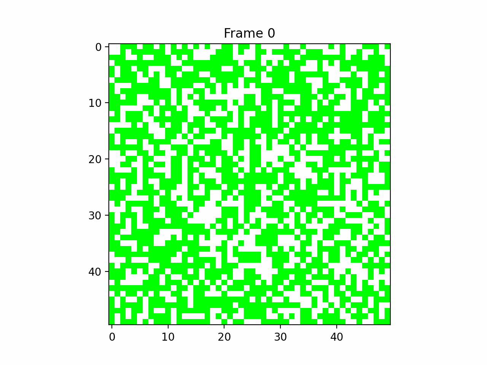

# Fire Simulation Project

Simulate and visualize the spread of fire in a grid over multiple time steps.



## Table of Contents

- [Introduction](#introduction)
- [Features](#features)
- [Requirements](#requirements)
- [Installation](#installation)
- [Usage](#usage)
- [Examples](#examples)
- [Contributing](#contributing)
- [License](#license)

## Introduction

The Fire Simulation Project allows users to simulate and visualize the spread of fire in a grid. The project is designed to model the propagation of fire over time, demonstrating the dynamics of fire spread in a controlled environment.

## Features

- **Grid Simulation:** Simulate the spread of fire in a 2D grid.
- **Visualization:** Visualize the grid configurations over multiple time steps using Tkinter and Matplotlib.
- **Customizable:** Easily modify simulation parameters and visualize different scenarios.

## Requirements

- Python 3.9
- NumPy
- Matplotlib
- Tkinter

## Installation

1. Clone the repository:

    ```bash
    git clone https://github.com/your-username/fire-simulation.git
    cd fire-simulation
    ```

2. Install dependencies:

    ```bash
    pip install -r requirements.txt
    ```

## Usage

To run the fire simulation:

```bash
python main.py
